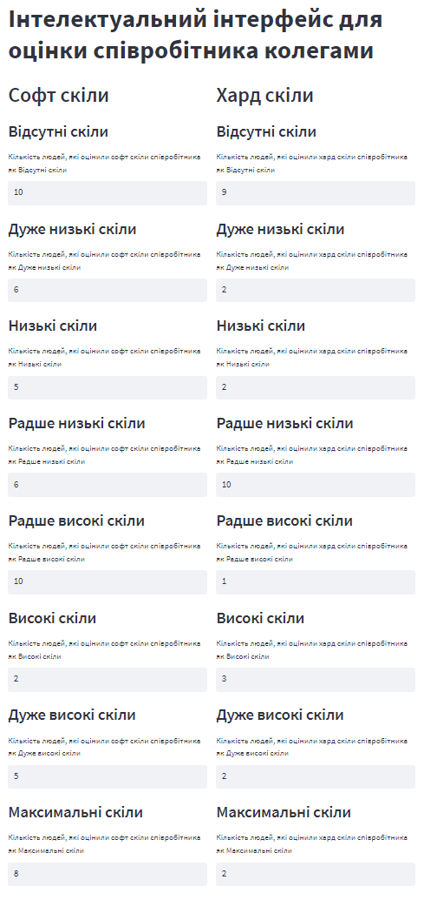
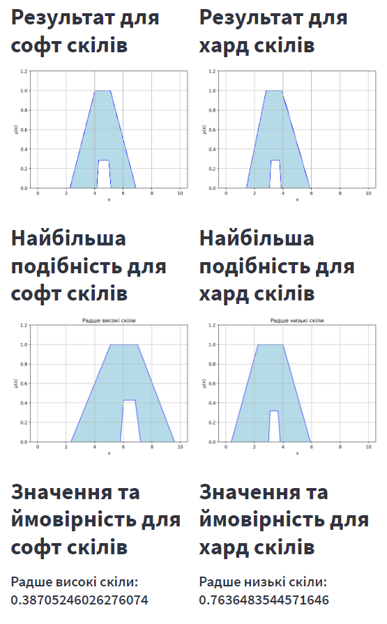
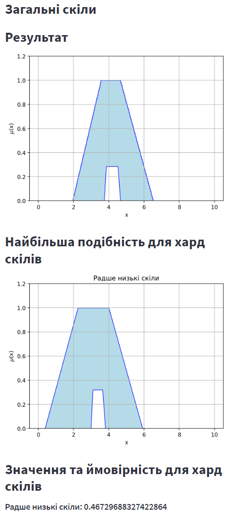

# Інтелектуальний інтерфейс для оцінки співробітника колегами

## Обґрунтування обраної моделі слів (codebook)

Обрано створення двох моделей на основі 8 слів, які відображають основні характеристики співробітника, а саме soft skills та hard skills.

Розкладання оцінки на м'які та тверді навички створює можливість більш глибоко та комплексно оцінити ефективність співробітника, дозволяючи враховувати як особисті якості, так і конкретні навички, що сприяє точнішій та адаптованій оцінці в різних робочих сценаріях.

На основі цих моделей буде визначатися загальна оцінка співробітника.

## Опис алгоритму обчислень зі словами

1. **Інтерфейс користувача:** Використовуючи бібліотеку `streamlit` для створення веб-інтерфейсу. Користувач може вказати кількість оцінювачів для кожного софт та хард навички співробітника.

2. **Оцінка софт та хард скілів:** Користуючись визначеними моделями софт (`skills_soft`) та хард (`skills_hard`) навичок для створення інтерфейсу та отримання оцінок.

3. **Обробка оцінок:** Кількість отриманих оцінок для кожного слова зберігається в списку `grades_soft` та `grades_hard`. Далі ці оцінки використовуються для побудови функцій приналежності та розрахунку альфа-відрізків.

4. **Обчислення результатів:** Використовуючи бібліотеку `lwa`, розраховується значення та ймовірність для софт та хард навичок. Результати відображаються в графіках.

5. **Загальні скіли:** Об'єднує оцінки софт та хард навичок для отримання загальних оцінок співробітника. Аналогічно розраховуються значення та ймовірності для загальних скілів.

### Моделі слів для м'яких навичок

```python
skills_soft = {
    'x': (0, 10.01, 0.01),
    'words': {
        'Відсутні софт скіли': {'umf': ('trapmf', 0, 0, 0.22, 3.16), 'lmf': ('trapmf', 0, 0, 0.02, 0.33, 1)},
        'Дуже низькі софт скіли': {'umf': ('trapmf', 0, 0, 1.37, 3.95), 'lmf': ('trapmf', 0, 0, 0.14, 1.82, 1)},
        'Низькі софт скіли': {'umf': ('trapmf', 0.38, 1.63, 3.00, 4.62), 'lmf': ('trapmf', 1.90, 2.24, 2.24, 2.51, 0.31)},
        'Радше низькі софт скіли': {'umf': ('trapmf', 0.38, 2.25, 4.00, 5.92), 'lmf': ('trapmf', 2.99, 3.31, 3.31, 3.81, 0.32)},
        'Радше високі софт скіли': {'umf': ('trapmf', 2.33, 5.11, 7.00, 9.59), 'lmf': ('trapmf', 5.79, 6.31, 6.31, 7.21, 0.43)},
        'Високі софт скіли': {'umf': ('trapmf', 4.38, 6.25, 8.00, 9.62), 'lmf': ('trapmf', 6.90, 7.21, 7.21, 7.60, 0.29)},
        'Дуже високі софт скіли': {'umf': ('trapmf', 4.73, 8.82, 10, 10), 'lmf': ('trapmf', 7.68, 9.82, 10, 10, 1)},
        'Максимальні софт скіли': {'umf': ('trapmf', 7.10, 9.80, 10, 10), 'lmf': ('trapmf', 9.74, 9.98, 10, 10, 1)},
    }
}
```

### Моделі слів для твердих навичок

```python
skills_hard = {
    'x': (0, 10.01, 0.01),
    'words': {
        'Відсутні хард скіли': {'umf': ('trapmf', 0, 0, 0.22, 3.16), 'lmf': ('trapmf', 0, 0, 0.02, 0.33, 1)},
        'Дуже низькі хард скіли': {'umf': ('trapmf', 0, 0, 1.37, 3.95), 'lmf': ('trapmf', 0, 0, 0.14, 1.82, 1)},
        'Низькі хард скіли': {'umf': ('trapmf', 0.38, 1.63, 3.00, 4.62), 'lmf': ('trapmf', 1.90, 2.24, 2.24, 2.51, 0.31)},
        'Радше низькі хард скіли': {'umf': ('trapmf', 0.38, 2.25, 4.00, 5.92), 'lmf': ('trapmf', 2.99, 3.31, 3.31, 3.81, 0.32)},
        'Радше високі хард скіли': {'umf': ('trapmf', 2.33, 5.11, 7.00, 9.59), 'lmf': ('trapmf', 5.79, 6.31, 6.31, 7.21, 0.43)},
        'Високі хард скіли': {'umf': ('trapmf', 4.38, 6.25, 8.00, 9.62), 'lmf': ('trapmf', 6.90, 7.21, 7.21, 7.60, 0.29)},
        'Дуже високі хард скіли': {'umf': ('trapmf', 4.73, 8.82, 10, 10), 'lmf': ('trapmf', 7.68, 9.82, 10, 10, 1)},
        'Максимальні хард скіли': {'umf': ('trapmf', 7.10, 9.80, 10, 10), 'lmf': ('trapmf', 9.74, 9.98, 10, 10, 1)},
    }
}
```

## База правил / фрагмент бази правил (за наявністю)

```python
skills = {
    'x': (0, 10.01, 0.01),
    'words': {
        'Відсутні скіли': {'umf': ('trapmf', 0, 0, 0.22, 3.16), 'lmf': ('trapmf', 0, 0, 0.02, 0.33, 1)},
        'Дуже низькі скіли': {'umf': ('trapmf', 0, 0, 1.37, 3.95), 'lmf': ('trapmf', 0, 0, 0.14, 1.82, 1)},
        'Низькі скіли': {'umf': ('trapmf', 0.38, 1.63, 3.00, 4.62), 'lmf': ('trapmf', 1.90, 2.24, 2.24, 2.51, 0.31)},
        'Радше низькі скіли': {'umf': ('trapmf', 0.38, 2.25, 4.00, 5.92), 'lmf': ('trapmf', 2.99, 3.31, 3.31, 3.81, 0.32)},
        'Радше високі скіли': {'umf': ('trapmf', 2.33, 5.11, 7.00, 9.59), 'lmf': ('trapmf', 5.79, 6.31, 6.31, 7.21, 0.43)},
        'Високі скіли': {'umf': ('trapmf', 4.38, 6.25, 8.00, 9.62), 'lmf': ('trapmf', 6.90, 7.21, 7.21, 7.60, 0.29)},
        'Дуже високі скіли': {'umf': ('trapmf', 4.73, 8.82, 10, 10), 'lmf': ('trapmf', 7.68, 9.82, 10, 10, 1)},
        'Максимальні скіли': {'umf': ('trapmf', 7.10, 9.80, 10, 10), 'lmf': ('trapmf', 9.74, 9.98, 10, 10, 1)},
    }
}
```

## Алгоритм інтерпретації отриманого результату

Алгоритм інтерпретації отриманого результату полягає в тому, що на основі вхідних даних (оцінок) визначається відповідність до одного зі слів, які відображають рівень навичок співробітника.
Алгоритм інтерпретації отриманого результату в даному коді можна розглядати наступним чином:

1. **Спостереження за результатами:** Після обробки оцінок та розрахунку значень і ймовірностей для софт та хард навичок, отримані результати відображаються на графіках для кожної категорії.

2. **Аналіз найбільш подібних навичок:** Для кожної категорії (софт, хард, загальні), алгоритм визначає рівень, який найбільше подібний. Це відбувається за допомогою визначення подібності між отриманими функціями приналежності та функцією відношення подібності між словами з використанням метрики Жаккара.

3. **Відображення результатів найбільш подібних навичок:** Графічно та текстово відображаються результати для найбільш подібних софт, хард та загальних навичок. Включає графік та значення і ймовірність.

Цей алгоритм допомагає визначити, які конкретні навички або категорії навичок найбільше відповідають отриманим оцінкам, що може бути корисним при аналізі ефективності та навичок співробітника.

## Приклад роботи програми

Вхідні дані згенеровані випадковим чином, проте можуть бути і введені користувачем.

### Вхідні дані



### Результат для м'яких навичок та твердих навичок



### Результат для загальної оцінки


